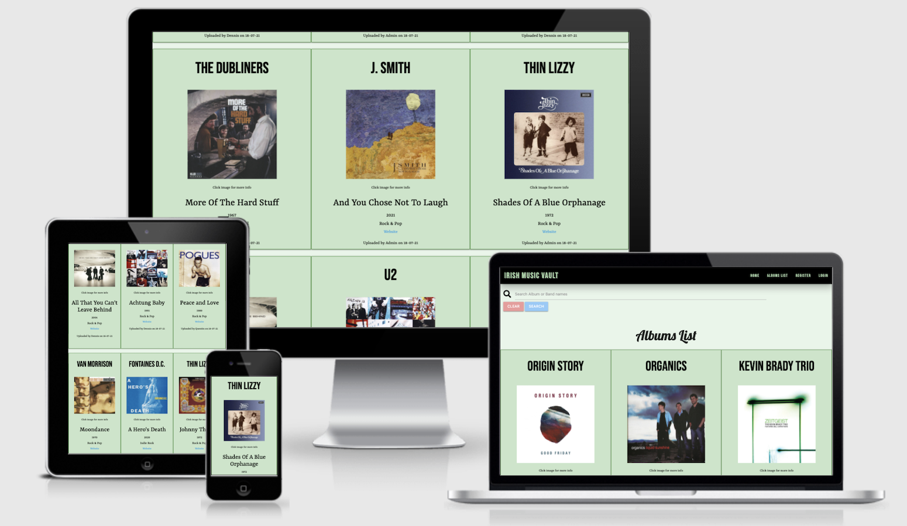
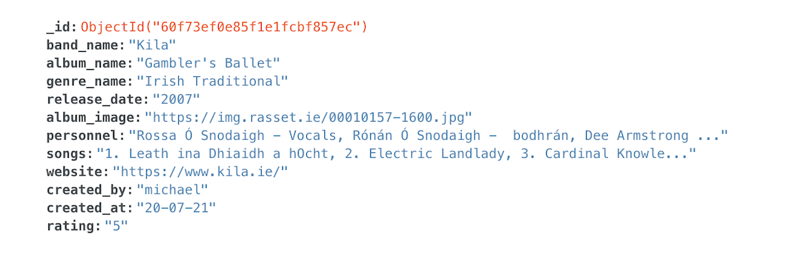
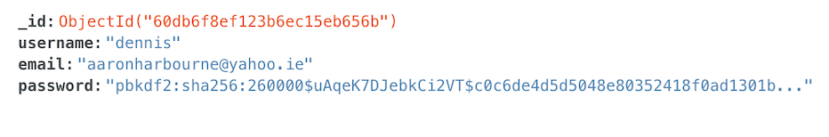
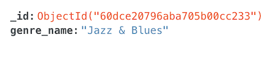
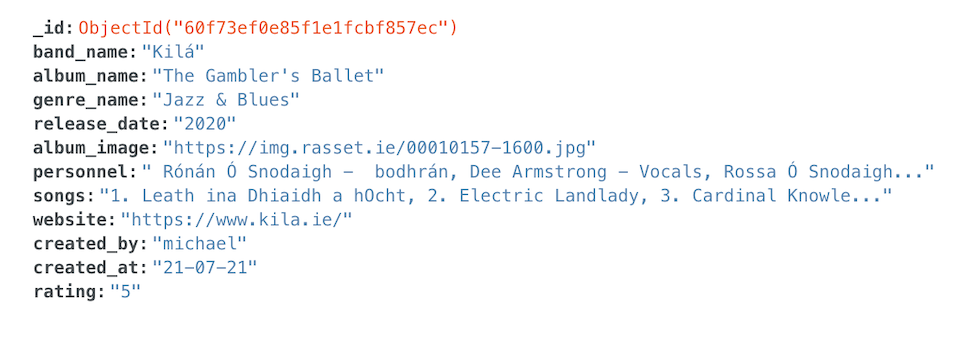
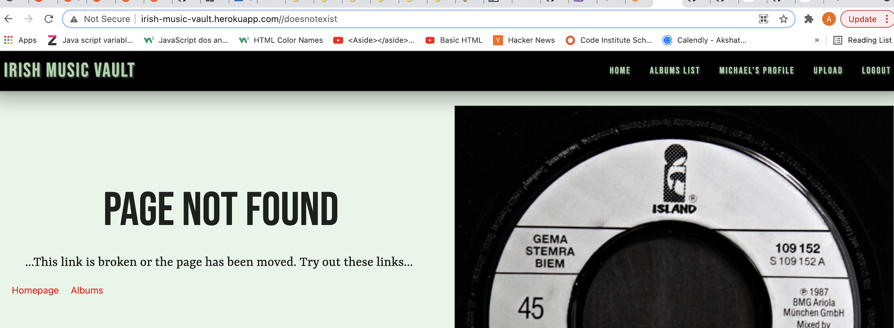
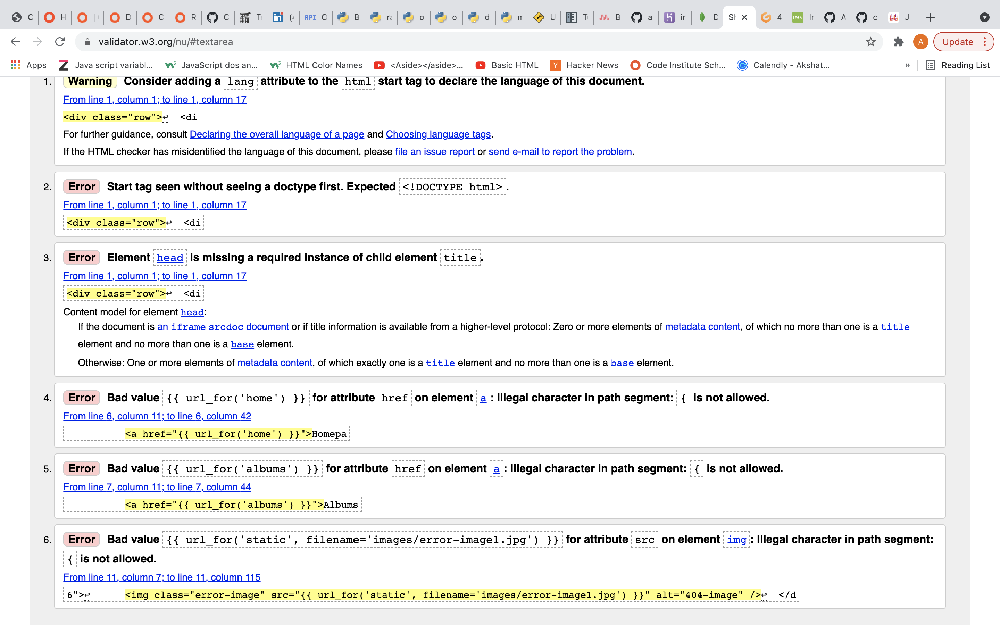

# IRISH MUSIC VAULT
Irish Music Vault is intended to be a comprehensive list of albums recorded by Irish bands to be updated by users of the site. The goal is to in time, have a fully comprehensive database of albums across a multitude of genres. The user can register an account and login to their own profile page which lists some details about their use of the site including uploads list/ personal info. Users can upload an album via an upload form which asks for a comprehensive list of information about an individual release. The user then has the option to edit/delete their upload from within their unique profile page. If they choose to edit an upload, they are given a form with the exact information that they provided which they can then alter as they wish. Deleting an upload removes it entirely. A home page with images of 'Top Rated Albums' and 'Recently Added Albums' is seen upon accessing the site. Finally an albums list page with all of the uploads uploaded by the sites users is scrollable with each image being clickable and leading the user to a page dedicated to that album alone. 

The idea for the site came from a friend who told me that while working at a small radio station in Ireland, she used a database of albums the criteria for which was that at least one band member had to be Irish. This was because the station had a quota of Irish bands that they played. 

Below are examples of the site running on four different devices.

Index page with two rows of images, one for Top Rated Albums and one for Recently Added Albums:

Albums List page with all uploads by users:

Registration page:

# UX
## User Stories:
1. As a visitor to the site, I am looking for a comprehensive database of albums by a diverse genre list of Irish bands.
2. As a visitor to the site, I want to be able to either add my own bands albums and/or another bands albums.
3. As a visitor to the site, I want to have my own profile page on which I can clearly see my own uploads and edit/delete them if I so wish. For this I would require the ability to register and login.
4. As a visitor to the site, I want a search bar with which to easily navigate the albums list. 
5. As a returning user of the site I want to be able to see any uploads added to the list by other users.

# Design
## Fonts
The site uses two fonts. 
1. For the main text on the site within paragraphs and the copyright, Cormorant Garamond is used and taken from Google Fonts. 
2. For headings and the site logo text, Comfortaa is used and taken from Gogle fonts.
## Color palette
1. The bar, footer

# Technologies Used
1. MongoDB was used as a database for holding any data related to the site.  
2. randomkeygen.com was used to get a strong password to use as my SECRET_KEY enviornment variable which was needed for use with the flash() and session() functions of Flask. 
3. Favicon.io was used to design a favicon for the site. (https://favicon.io/favicon-generator/)
4. Github was used as a repository onto which to save my project.
5. Gitpod/Visual Studio Code was used as an editor with which to write the code. 
6. Heroku was used for deploying the site to the browser as Github pages cannot host Python projects.
7. Flask which is a Python framework was used to build the site.
8. Pymongo was used to connect the MongoDB database to my project.
9. Werkzeug which is a Python security feature, was used to generate a hashed (indecipherable on the database) password.
10. Balsamiq was used to create wireframes for the project.
11. Materialize CSS was used as a css framework to style my site and make it responsive.
12. Font Awesome was used to get icons for buttons.
13. Google Fonts was used to get the fonts used in the site.
14. JQuery was used for getting code to initialise Materialize CSS features.
15. Jinja is part of the flask application. It is used for writing Python code in html files and while debug is set to True in the application, it shows error messages when code is throwing an error, giving the source of the problem in the code.
16. Am I Responsive (http://ami.responsivedesign.is/) was used to get screenshots showing the site displaying across four different device sizes for use in the README.md file

## Languages used
1. Html5
2. Css3
3. JavaScript
4. Python 3.8.1

# Features
1. A separate home page ( login_home.html ) for logged in users which displays a different set of albums...

# Testing
When setting up the flask app in the app.py file, debug was set to true in the app.run method within the 'if __name__ == "__main__":' statement, which is used to instruct the application on which parameters to run flask on by use of enviornment variables. This is a development procedure that will present a Jinja error screen if there is a bug within a piece of code, and will point me to where in the code the error exists. This was set to false before submission of the project.

## Manual Testing Of Each Section Of The Site
### BASE.HTML
base.html consists of the navbar, which is viewed on mobile by clicking on a 'burger bar' icon which sees the navbar scroll in from the left of the screen. Also this file includes the footer. The navbar and footer are then used on each page of the project.
* The Irish Music Vault logo on the left of the navbar returns the user to the home page evidenced by the /home path in the url.
* On the right side of the navbar, the 'Home' button returns the user to the homepage evidenced again by the /home url path.
* The 'Albums List' button brings the user to the albums page evidenced by the /albums path in the url.
* The 'Register' button brings the user to the registration page evidenced by the /registration path in the url.
* The 'Login' button brings the user to the login page evidenced by the /login path in the url.
For Logged in Users(different set of links in the navbar):
* The 'User's Profile' button brings the user to the profile page evidenced by the /profile?username=username path in the url.
* The Upload button brings the user to the upload page evidenced by the /upload path in the url. 
* The logout button succesfully logs out the user. Typing /logout at the end of the sites url while logged in will log the user out.
In Mobile view these links are accessed via the screen that floats onto the screen from the left after pressing the 'burger bar' button. These mobile-view buttons act in exactly the same way as above.
* In the footer the same buttons appear on the left of the screen (top of the footer on mobile view). Testing them shows they work in exactly the same way as above. 
* On the right side of the footer (Underneath site navigation links on mobile-view), the Facebook logo takes the user via a new tab to the Facebook.com login page.
* To the right of that, the Instagram logo takes the user to the Instagram login page in a new tab.  
* On the right side of these links, the Twitter logo brings the user to the Twitter login page. 

### HOME.HTML
The home page consists of two rows of album cover images, one above and one below a written explanation of the site.
* Clicking on any album cover results in the user being brought to the view-album.html page which has more in-depth information about the album. Clicking on an album image brings the user to this page and changes the url path to '/albums/<album_id>/view'.

### ALBUMS.HTML
The albums list page presents the user with a search bar and the list of albums uploaded by all users
* The search bar on the top of the screen can be searched with both band names and album names. I can test this by typing 'Thin Lizzy' into the input. This results in the two so far uploaded 'Thin Lizzy' albums appearing on screen by themselves without any other albums. I can test that the album name is searchable by typing 'Johnny The Fox' into the input. This results in the album by that name appearing by itself on the page. 
* The search bar can render results based on partially inputted data. For example typing 'J' into the search bar will return the listing for the artist named 'J. Smith'. Typing 'Eye' into the search bar returns the listing for the album 'Watchful Eye Of The Stars'. 
* This method however, does not appear to give results based on common words such as 'And', 'All', 'The', 'A', 'Of' and other such connector words. 'More of the Hard Stuff' by 'The Dubliners' can be searched using 'Hard' and 'Stuff' alone. Similarly while searching using the partial band name, only 'Dubliners' will give a result for this bands listings.
* If a search renders no result, a notice displaying the words 'No uploads found' is shown to the user. Also a button with 'Back' written on it is displayed. Clicking this will bring the user back to the default albums list page with every listing in the database being presented. 
* Each album is presented in a card format and each has a clickable image bringing the user to a new page with more information (with a '/albums/<album_id>/view' url path) and a clickable website link linking the user to the bands website in a new tab.

### REGISTRATION.HTML
The register.html page gives the user a form containing the fields 'username', 'email' and 'password' as well as a button with 'Sign Up' for submitting the form. Below this is a link to the login page if the user already has an account. Each input field is grey by default. Each input field then turns tourqoise while the user is typing inside it. 
* The username field has a form validation feature which turns the input field to a light green colour if the input is valid. The input requires a username of at least five characters and at most twenty characters. To test this I write 'mich' into the input and press tab. The input field changes to a red colour. Completing the username with 'michael' and pressing tab moves onto the next field and changes the field colour to light green indicating that the username is acceptable. Trying to submit the form without this field being filled in will result in an on screen error beside the field which asks the user to 'Please fill in this field'. 
* Typing an email address minus the @ symbol will result in the input field changing to a red colour. I tested this by typing 'michael' into the field and pressing tab. If the user attempts to press the submit button, an on screen error asking the user to 'Please include an '@' in the email address. 'michael' is missing an '@'' will appear beside the field. Once a valid email address is entered, in this case 'michael@email.com' and tab is pressed, the field will change to light green.
* The email field also has a validation in the app.py file. Should a valid username and password be supplied minus an email address and the submit button pressed, a warning in red font saying 'Please enter a valid email address' will appear above the form.
* The password must be between five and twenty characters long. The valid characters include lowercase a-z, uppercase A-Z, and numbers 0-9. Testing this field demonstrates that leaving it blank and pressing tab will change the field colour to red. Pressing the submit button will cause a warning to display beside the field which states 'Please fill in this field'. Entering a valid password and pressing tab changes the field colour to light green. 
* Pressing submit when all fields are entered correctly will submit the form successfully and in this test case I am now brought to the profile page set up for Michael. 

### LOGIN.HTML
The login page has the same input fields as the registration page minus the email input. The same validation errors and success indicators will be shown upon user interaction with it. Similar to the registration page, successful completion of the form followed by pressing the submit button will bring the user to their user profile page.

### PROFILE.HTML
The profile page contains two sections. One for user details and another that contains any uploads a user has submitted. 
* In the user details section at the top of the screen there are four pieces of user data. The first is the user's username which is set to the username that they registered with. In this test case it is set to 'michael' as per the registration testing above. The email is set to 'michael@email.com' as per the test case above. The next two are 'Total Uploads' and 'Uploads Rated 5/5'. 'Total Uploads' is set to 0 as I have not uploaded anything yet. 'Uploads Rated 5/5' is currently empty. The section below this which shows the albums that I have uploaded is also empty.
* I will test these by uploading an album in the upload section, in this case 'Gambler's Ballet' by Kila
* As expected, in the user details section the 'Total Uploads' has been increased to '1'. As I rated it 5/5 it has been included in the section titled 'Uploads Rated 5/5. Also as expected the album listing which also appears on the albums page has appeared on the lower half of the profile page. 
* Included in this album listing unlike on the albums page, is an edit and delete button unique to the profile page. Pressing on the edit button brings me to the edit page. 
* Clicking on the delete button opens up a modal that asks me to confirm the deletion. When I press 'No' the profile page is reloaded and the upload remains in the database. When I click 'Yes' the upload is deleted from the database permanently.

### UPLOAD.HTML
The upload page contains nine input fields for uploading an album. Also included are two for 'created_by' and 'created_at' which the user does not modify. These automatically upload the users name and date of upload to the database. Three of the input fields use the same validation methods as in the register.html page mentioned above turning the field to red if the user has filled them in incorrectly. Only band name, album name and year of release are required in these fields. This is because these fields are the minimum required to describe the album listing to a user of the site. I will upload the album 'Gambler's Ballet' by Kila once more and this is the result in the MongoDB database:

The database contains three collections. One for albums, the contents of which is exemplified by the above screenshot. The next is 'Genres' and the third is 'Users'. 

Screenshots below demonstrate the contents of each:

--------------------------------------------------------------------------------------------------------------------------

### EDIT.HTML
The edit page features the same form as the upload page with all inputted information visible to the user to modify. This is accessed by the edit button on the uploads list section of the profile page. I will test this feature by modifying the upload for kila. I will alter the name to include a fada which they use in their name. I will add a 'The' to the album title. I will re-arrange the personnel list and I will change the release year field to 2020. Also I will change the genre to Jazz & Blues (I will change some of this back afterwards).
The result is visible here: 

### VIEW-ALBUM.HTML
The album view page, accessed by clicking on an album image brings the user to a page with more information about the release, all taken from the database. The page contains only two interactive buttons:
* The link to the bands website opens up the webpage in another tab.
* The button with 'Back to Albums' on it brings the user to the albums list page as expected.

### 404.HTML
The 404.html page is a custom 404 page accessed when a user attempts to access a url path that does not exist. To test this I will try and access a page with the path /doesnotexist in the url. Doing this brings me to the custom 404 page:

The page also contains two links 
* The 'Homepage' link returns me to the homepage.
* The 'Albums' link brings me to the albums page.

#### Error Handling
The logged out user cannot access the Profile, Upload, Edit pages. Also the delete and logout functions are not avaiable to the logged out user. To test this, while logged out I type /profile into the url and am returned to the homepage. I then type /upload into the url and am returned to the homepage. I then type /edit/<album_id> into the url and am returned to the homepage. Typing /delete/<album_id> and /logout also return me to the homepage. 

To the logged in user, the login and registration pages are unavailable. To test this I type /login and /registration into the url and am both times returned to the homepage. 

## Site Responsiveness
The responsive element of this site was tested using three different methods:
* The first was within the developer tools on Google Chrome. This is accessed by pressing control and left click on the mouse. Then on the menu that displays as a result, clicking on inspect at the bottom. This allows me to look at the site as it would appear on a variety of different device sizes. Using these different device views I can see where there are issues and fix them accordingly using media queries in the css file. 
* Using the site Am I Responsive (http://ami.responsivedesign.is/), I was able to test how the site looked on four different widely varying device sizes. Screenshots from this site are included at the top of this README file. 
*  I had access to multiple devices during development. I had an iPhone 5 and 7, MacBook Pro (13" screen) and another 15" screen laptop aswell as a 21" wide/13" inch high monitor. Using these I could test the sites responsiveness

## Code Validation
HTML: the html was validated using the W3C validator from the site https://validator.w3.org/. As can be seen from the following screenshot most, and in the case of this screenshot, all of the errors are related to the use of Flask rather than errors within the actual HTML syntax itself. These were ignored while validating the html.

CSS: the css file was validated using The W3C CSS Validation Service (http://jigsaw.w3.org/css-validator/validator) and no errors were found.

JavaScript: The javascript file was validated using JShint (https://jshint.com/) with no errors being found.

Python: My Python code was validated using the Pep8 validator (http://pep8online.com/) with a status of 'All Right' being returned. Also I made sure to remove all errors in my python file using the debugger in the console. The only remaining error is telling me that 'env.py imported but unused'. This I will ignore as this is related to my env.py file, which contains my enviornement variables for running the Flask app, that is within my .gitignore file and thus not saved to GitHub. This is why I am getting this error and can be ignored.

## Testing of User Stories
1. As a visitor to the site, I am looking for a comprehensive database of albums by a diverse genre list of Irish bands.
(This can be accessed on the albums list page as well as on the homepage where any newly added albums or albums rated 5/5 can be seen in the two image rows)
2. As a visitor to the site, I want to be able to either add my own bands albums and/or another bands albums.
(A user is free to upload any bands albums including their own)
3. As a visitor to the site, I want to have my own profile page on which I can clearly see my own uploads and edit/delete them if I so wish. For this I would require the ability to register and login.
(The user upon registration or logging in is brought to their own profile page wherein they can achieve these goals)
6. As a visitor to the site, I want a search bar with which to easily navigate the albums list.
(The albums list page features this and allows the user to search by band name and album title) 
7. As a returning user of the site I want to be able to see any uploads added to the list by other users.
(These are added to the albums list page as soon as the user clicks upload and can be seen by any user of the site)

# Bugs
1. On the albums.html page, when trying to loop over the 'genre_name' key within my 'genres' collection I was unable to use the same 'for loop' twice. This is because the variable 'genres' that I had assigned the 'mongo.db.genres.find()' method to within the app.py file can only 'unpack' the data from the mongoDB database once. This was fixed by enclosing the method within the list() method (i.e. list(mongo.db.genres.find()) ) to convert the returned data into a list object. The data can then be rendered more than once.
2. In the console while running my app.py file, I was getting a deprecation warning. This was 'DeprecationWarning: count is deprecated. Use Collection.count_documents instead.' and this was appearing for the variable 'count = mongo.db.albums.find({"created_by": session["user"]}).count()'. Adjusting my code resulted in 'count = mongo.db.albums.count_documents({"created_by": session["user"]})'. This fixed the deprecation warning for this instance.
3. On the edit page when importing information from the database to use as placeholder text that the user might want to edit, the 'option' element for the rating input was defaulting to '5' in the browser rather than the correct uploaded rating from the database, if it was not five. This would necessitate the user to be certain to check the rating to make sure it was correct each time they were editing the album and thus would likely lead to errors if the user did not notice the incorrect rating. To fix this I changed the option element to a regular input field, '<input id="rating" name="rating" type="text" ... value="{{ album.rating }}">'. This fixed the problem.  
4. In the Python debugger in the console, in relation to my except messages a warning was showing telling me not to use 'bare except'. According to a question and answer page on stack overflow (https://stackoverflow.com/questions/54948548/what-is-wrong-with-using-a-bare-except) this is because it can cause unforeseen problems down the line. To fix this I changed the except code to 'except Exception:' and this worked fine. 

# Deployment

## Deployment to Heroku
1. In the command line, 'pip3 freeze --local > requirements.txt' is run in order to set up a requirements.txt file. Heroku uses this to see what dependencies are needed to run the application.
2. A Procfile is created which tells Heroku which Python file is used in order to run the application. The command in the command line interface is 'echo web: python app.py > Procfile'. App.py is a standard naming convention for this type of Python file. Inside this Procfile is 'web: python app.py'.
3. These two files are then pushed to GitHub. Heroku will be running the application via the GitHub repository and so any files needed to run the app should be present there. 'git add -A', 'git commit -m "Add requirements.txt and Procfile"' and 'git push' are used to push these files to GitHub.
4. After setting up an account at heroku.com, on the dashboard I click the button with 'New' written on it, in the top right-hand corner of the screen, and then 'Create new app' from the dropdown menu. On the following page I create the name of my app which is 'Irish-Music-Vault' and click the 'European' option for which region I am in. I then click the 'Create app' button below the two dropdown menus.
5. On the next page which is the dashboard for my project, I click on the GitHub icon which allows me to connect my GitHub account and choose the name of my repository to link to, making sure that the link is being made to my personal GitHub account. Once my repository is found I click on the button with 'connect' written on it. My project is now linked to my Heroku project.                           
6. Next I need to pass my enviornment variables to Heroku. This is necessary as these variables are stored within my env.py file which has been passed to my .gitignore file. This .gitignore file stops whatever files are marked inside it from being pushed to GitHub. The env.py file contains private information such as a password and thus should not be pushed to GitHub where it can be viewed publicly. So, clicking on settings in the horizontal menu near the top of the page and then clicking on the 'Reveal Config Vars' button within the Config Vars section I am now presented with a form in which to write the key, value pairs into, minus any quotation marks around these key, value pairs. 
7. Then, back within the 'Deploy' section of my Heroku profile, and within the 'Automatic Deploys' area, I click on the 'Enable Automatic Deploys' button. 
8. Once Heroku has finished retrieving information from my GitHub repository I am presented with a button with 'View' written on it. This allows me to open up the project in the server.
9. When accessing the project from within Heroku thereafter I clicked on the 'open app' button on the top right of the screen. The url that appeared in the browser was then sharable as a link to the deployed project.

# Credits
